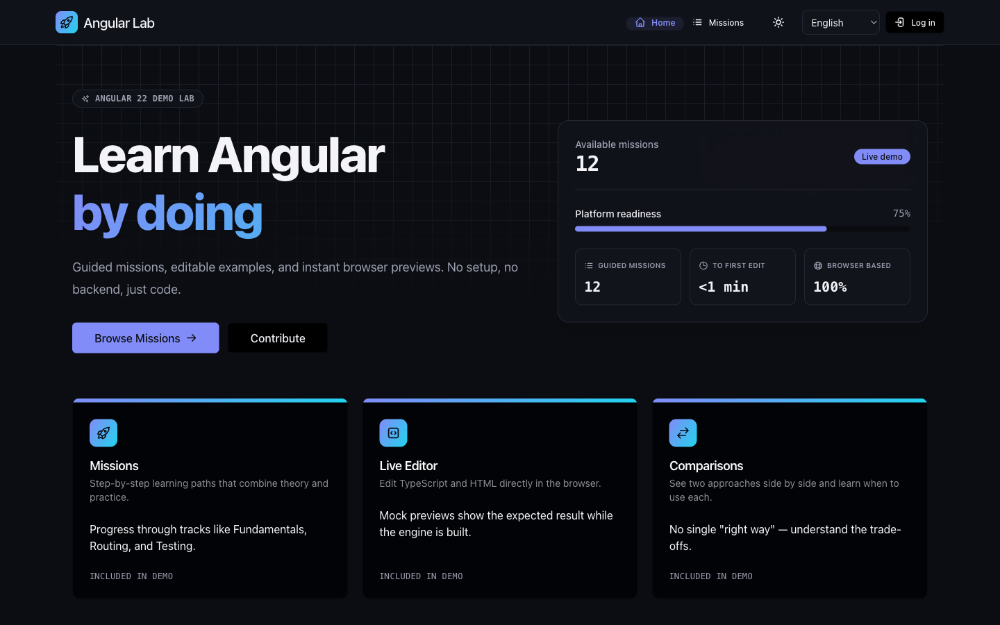
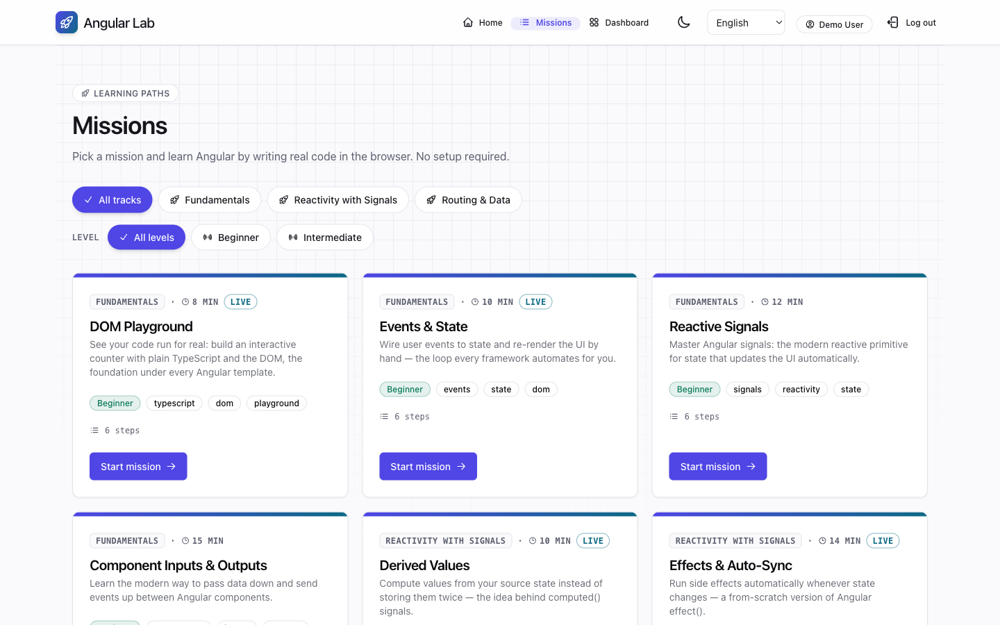
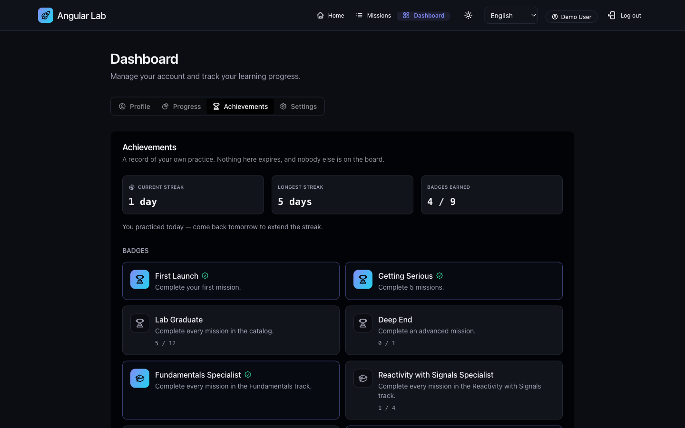
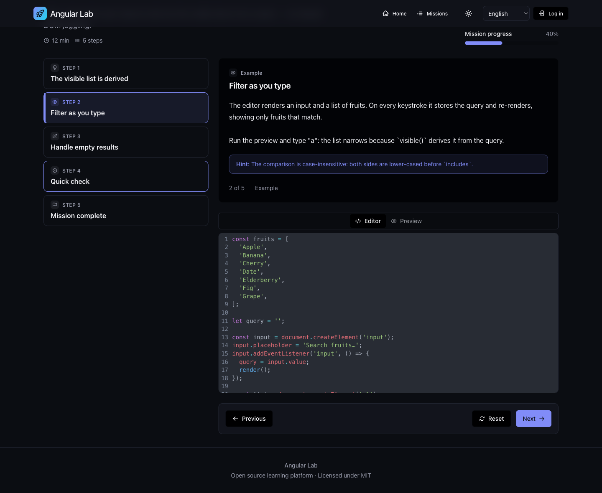
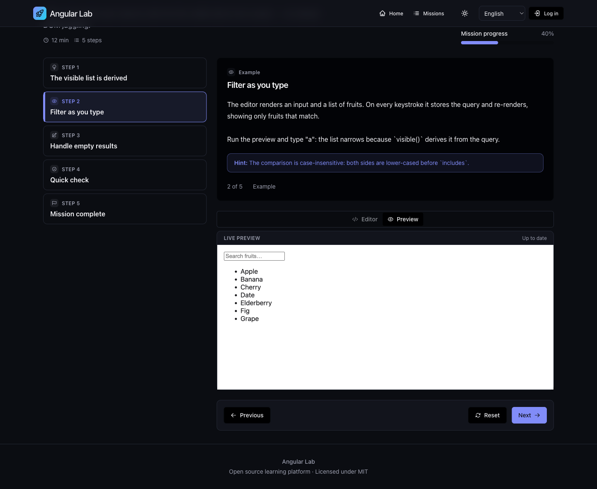
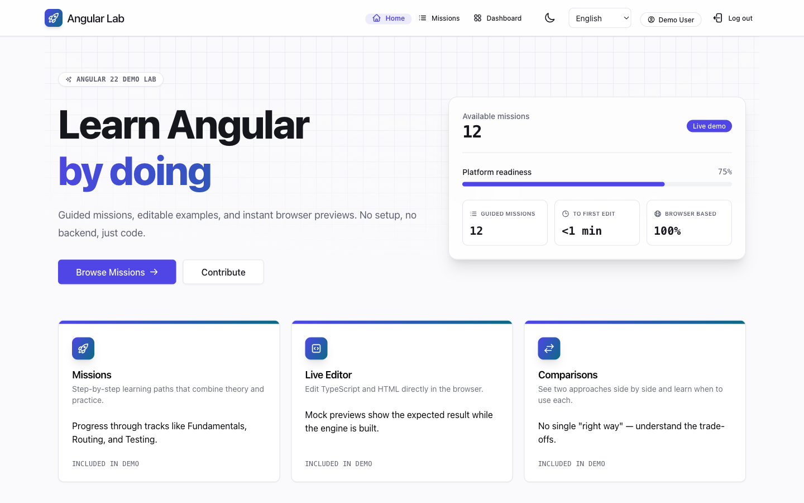
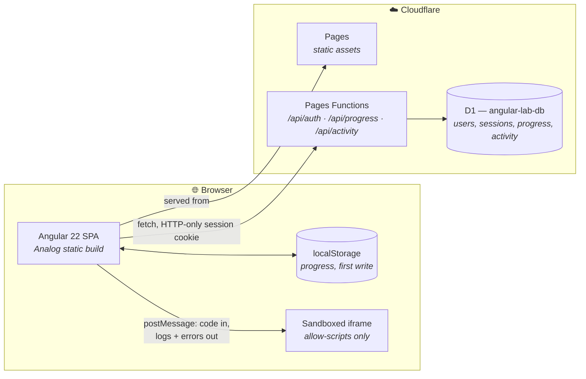
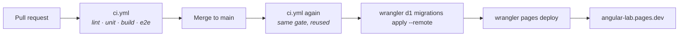

<div align="center">



<br>
<br>

# Angular Lab

### Learn modern Angular by doing — not by reading.

**12 guided missions. Real code, executed in your browser. No install, no backend account, no setup.**

<br>

[](https://github.com/Andersseen/angular-lab/actions/workflows/ci.yml)
[](https://github.com/Andersseen/angular-lab/actions/workflows/deploy.yml)
[](LICENSE)

[](https://angular.dev)
[](https://analogjs.org)
[](https://www.typescriptlang.org)
[](https://tailwindcss.com)
[](https://developers.cloudflare.com/pages/)

[](#-testing)
[](#-the-mission-catalog)
[](#-internationalization)
[](#-quality-bar)

<br>

### [🚀 **Open the live app**](https://angular-lab.pages.dev)

<br>

[**Quick start**](#-quick-start) · [**Screens**](#-screens) · [**How it works**](#-how-it-works) · [**Missions**](#-the-mission-catalog) · [**Testing**](#-testing) · [**Deployment**](#-deployment) · [**Contributing**](CONTRIBUTING.md)

</div>

---

## 💡 Why Angular Lab

Most Angular tutorials ask you to read a wall of prose, then copy a snippet into a project
you had to scaffold yourself. Angular Lab inverts that: every mission is a handful of short
steps, and the code in them is **editable and executed for real** in a sandboxed iframe —
you change a line, you see the result, immediately.

|   | |
|---|---|
| ⚡ **Runs entirely in the browser** | TypeScript is transpiled client-side and executed in a sandboxed iframe (`allow-scripts`, no `allow-same-origin`). Nothing you write leaves your machine. |
| 🧭 **Missions, not chapters** | Each mission is 8–15 minutes: concept → comparison → hands-on exercise → checkpoint quiz → completion. Progress is tracked per step. |
| 🆓 **No account required** | Guests get the full platform; progress lives in `localStorage`. Sign up only if you want it synced across devices. |
| 🔄 **Progress that follows you** | Log in and local progress merges with the server copy — local-first writes, then a write-through sync to Cloudflare D1. |
| 🔥 **Reflective engagement** | A practice-day streak, 9 derived badges and a shareable completion card. Deliberately **no** points, leaderboards or notifications. |
| 🌍 **Three languages** | English, Español, Українська — UI *and* every word of mission content. Switching is instant, with no reload. |
| ♿ **Accessible by default** | Full keyboard path through every mission, announced checkpoint feedback, and Lighthouse a11y 100 in both themes. |

---

## 📸 Screens

<table>
  <tr>
    <td width="50%"><br><sub><b>Mission catalog</b> — filter by track and level.</sub></td>
    <td width="50%"><br><sub><b>Achievements</b> — streak and derived badges.</sub></td>
  </tr>
  <tr>
    <td width="50%"><br><sub><b>Editor</b> — edit the example in place.</sub></td>
    <td width="50%"><br><sub><b>Live preview</b> — your code, actually running.</sub></td>
  </tr>
</table>

<details>
<summary><b>Light theme</b></summary>



Every surface is driven by the `--al-*` design-token layer in `src/styles.css`, so both themes
are one definition, not two stylesheets.

</details>

---

## 🚀 Quick start

> **Requirements:** Node.js ≥ 20.19.1 (CI uses 22) and [pnpm](https://pnpm.io/).

```bash
git clone https://github.com/Andersseen/angular-lab.git
cd angular-lab
pnpm install
pnpm dev            # → http://localhost:5173
```

That is enough to browse missions, edit code and run the playground.

### ⚠️ The one gotcha worth knowing

`pnpm dev` is plain Vite — it serves **no Pages Functions and no database**. Anything touching
accounts, progress sync or streaks will fail there. For those, build and serve through Wrangler:

```bash
pnpm db:migrate     # apply D1 migrations to the local database
pnpm dev:pages      # → http://localhost:8788, with Functions + D1
```

| Command | What it does |
|---------|--------------|
| `pnpm dev` | Vite dev server on `:5173` — fast HMR, **no** backend |
| `pnpm dev:pages` | Build + `wrangler pages dev` on `:8788` — **with** Functions and D1 |
| `pnpm db:migrate` | Apply D1 migrations to the local database |
| `pnpm test:unit` | Vitest + Angular Testing Library (~8s) |
| `pnpm test:e2e` | Playwright, chromium |
| `pnpm lint` | ESLint (`lint:fix` to autofix) |
| `pnpm build:prod` | Production build → `dist/analog/public` |
| `pnpm install:vertex` | Refresh the vendored Vertex Editor assets |

---

## 🧩 How it works



**Local-first, then synced.** A mission step is written to `localStorage` first and always;
the network is a second, best-effort step. That is why guests get the full experience, and why
losing connectivity mid-mission never loses your place.

**The playground never trusts your code.** It is transpiled in the main thread but executed in
an iframe with `allow-scripts` and *without* `allow-same-origin`, so it has no access to the
app's origin, cookies or storage. The TypeScript compiler (~3.5 MB) is a lazy chunk loaded only
on missions that actually execute.

### Project layout

```text
angular-lab/
├── .github/workflows/    ci.yml (the quality gate) · deploy.yml (the only path to prod)
├── e2e/                  Playwright specs — home, mission, playground, auth, achievements…
├── functions/api/        Pages Functions: auth, progress and activity endpoints
├── migrations/           numbered D1 migrations (0001 → 0005)
├── public/i18n/          UI translations + missions/ (all mission text, all languages)
├── specs/                behavior specs — the source of truth, written before the code
├── src/app/components/   standalone signal-based components (ui/ holds shared primitives)
├── src/app/core/         services, models, guards, playground and achievement logic
├── src/content/missions/ mission structure (MissionMeta) — no learner-facing text
└── src/styles.css        Tailwind v4 + the --al-* design-token layer
```

Two files carry the project's memory and are worth reading before any change:
**[`context.md`](context.md)** (architecture and every design decision, with the reasoning) and
**[`PLAN.md`](PLAN.md)** (the roadmap and what is deliberately *not* next).

---

## 🎯 The mission catalog

12 missions across 3 tracks. **8 execute your code for real**; the 4 that teach Angular-framework
APIs use a curated mock preview, because running the Angular compiler in the browser needs
WebContainers (COOP/COEP) — evaluated and deferred, see `context.md` Decision 8.

| Track | Mission | Level | Preview |
|-------|---------|-------|---------|
| **Fundamentals** | DOM Playground | Beginner | ⚡ Live |
| **Fundamentals** | Events & State | Beginner | ⚡ Live |
| **Fundamentals** | Reactive Signals | Beginner | 🖼️ Mock |
| **Fundamentals** | Component Inputs & Outputs | Beginner | 🖼️ Mock |
| **Reactivity with Signals** | Derived Values | Beginner | ⚡ Live |
| **Reactivity with Signals** | Effects & Auto-Sync | Intermediate | ⚡ Live |
| **Reactivity with Signals** | Build a Searchable List | Intermediate | ⚡ Live |
| **Reactivity with Signals** | Dependency Injection Basics | Intermediate | 🖼️ Mock |
| **Routing & Data** | Modern Angular Routing | Intermediate | 🖼️ Mock |
| **Routing & Data** | Handle Form Validation | Intermediate | ⚡ Live |
| **Routing & Data** | Async Data & Loading States | Intermediate | ⚡ Live |
| **Routing & Data** | Sort a Data Table | Intermediate | ⚡ Live |

Adding a mission needs **no engine or service change** — a `MissionMeta` file, a registration in
`src/content/missions/index.ts`, and the text in `public/i18n/missions/*.json`. See
`context.md` § *Adding a New Mission*.

---

## 🌍 Internationalization

English, Spanish and Ukrainian, covering the UI **and every word of mission content**. No
learner-facing string lives in a `.ts` file — not even the English one. Structure (`MissionMeta`)
and text (`public/i18n/missions/*.json`) are separate concerns, and
`src/content/missions/translations.spec.ts` runs 307 structural checks so a translation can never
silently drift from the mission it describes.

> The Spanish and Ukrainian mission translations are AI-generated and structurally verified, but
> have not been reviewed by a native-speaking Angular expert. Corrections are very welcome.

---

## 🧪 Testing

| Suite | Scope | Count |
|-------|-------|-------|
| **Vitest + Angular Testing Library** | Components and services, asserted through user-visible behavior | 473 tests / 44 files |
| **Playwright** | Full journeys against a real Wrangler server with Functions + D1 | 17 tests / 7 specs |

```bash
pnpm test:unit                                   # ~8s
pnpm exec playwright install --with-deps chromium # once
pnpm test:e2e
```

Tests assert what a learner can observe, never private implementation details. The E2E suite runs
single-worker on purpose: every test shares one local D1 database and per-IP rate-limit buckets,
so parallel workers cause write contention and flaky auth runs.

### Quality bar

- ✅ ESLint clean, TypeScript strict
- ✅ Lighthouse accessibility **100** in both light and dark themes
- ✅ Every route is a separately lazy-loaded chunk
- ✅ A full mission is completable with the keyboard alone

---

## ☁️ Deployment

**One pipeline, one target.** Every push to `main` runs the full CI gate and, only if it is green,
applies pending D1 migrations and deploys to Cloudflare Pages. There is no second path — see
[`docs/deployment.md`](docs/deployment.md) for the setup and the rules.



Two repository secrets are required — `CLOUDFLARE_API_TOKEN` and `CLOUDFLARE_ACCOUNT_ID` — under
**Settings → Secrets and variables → Actions**.

> [!IMPORTANT]
> Cloudflare's own Git integration must stay **disconnected** for this project. If it is
> connected, every push builds twice and the two deployments race for the same alias.

---

## 🤝 Contributing

Contributions are welcome — missions especially. This project is **spec-driven**: behavior is
described in [`specs/`](specs/) before it is coded. Read
**[CONTRIBUTING.md](CONTRIBUTING.md)** for the workflow and the standards, and
[`specs/contribution-principles.md`](specs/contribution-principles.md) for the reasoning behind them.

Two things are out of scope by decision, not by omission: **payments**, and **competitive
engagement mechanics** (points, leaderboards, streak penalties, notifications). Engagement here
is reflective — it reports practice you already did. See [`specs/engagement.md`](specs/engagement.md).

---

## 🛠️ Built with

Angular Lab is also a showcase for three first-party libraries by the same author — that is
deliberate, and the routing rule between them is written down in `context.md` Decision 18.

| | |
|---|---|
| **[Analog.js](https://analogjs.org)** 2.6 | Angular meta-framework; static build (`ssr: false`) |
| **[Angular](https://angular.dev)** 22 | Standalone, signal-based components throughout |
| **[Volt UI](https://www.npmjs.com/package/@voltui/components)** | Component library |
| **[quartz-headless](https://www.npmjs.com/package/quartz-headless)** | Headless primitives Volt does not cover |
| **[angular-movement](https://www.npmjs.com/package/angular-movement)** | Animations |
| **[Vertex Editor](https://github.com/Andersseen/vertex)** | The in-page code editor, as a web component |
| **[Tailwind CSS](https://tailwindcss.com)** v4 | Styling, through an `--al-*` token layer |
| **[Cloudflare](https://developers.cloudflare.com/pages/)** | Pages · Pages Functions · D1 |

---

## 📄 License

[MIT](LICENSE) © [Andersseen](https://github.com/Andersseen)

<div align="center">
<br>
<sub>If Angular Lab helped you learn something, a ⭐ makes it easier for the next person to find.</sub>
</div>
