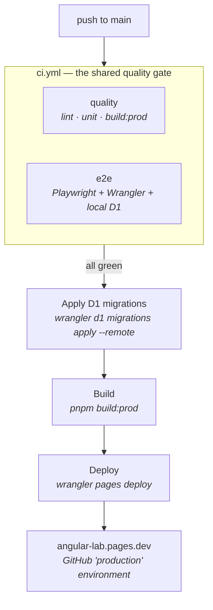

# Deployment

Angular Lab has **exactly one deployment path**: GitHub Actions → Cloudflare Pages. This document
describes it, how to set it up from scratch, and the one configuration mistake that breaks it.

## The rule

> **Cloudflare's own Git integration must stay disconnected.**

Cloudflare Pages can build a project itself when connected to a GitHub repository. If that is
enabled *and* `deploy.yml` is active, every push to `main` produces **two builds racing for the
same production alias** — with no ordering guarantee about which one wins. The observable symptom
is a deploy that "reverts" for no reason, or a live site that lags a commit behind.

To verify it is off: **Cloudflare dashboard → Workers & Pages → angular-lab → Settings → Builds &
deployments**. There should be no connected Git repository. If there is, disconnect it — the
project keeps its domain, its D1 binding and its deployment history.

## The pipeline



Two workflows, one gate:

| File | Trigger | Purpose |
|------|---------|---------|
| [`.github/workflows/ci.yml`](../.github/workflows/ci.yml) | `pull_request` **and** `workflow_call` | Lint, unit tests, production build, E2E |
| [`.github/workflows/deploy.yml`](../.github/workflows/deploy.yml) | `push` to `main`, `workflow_dispatch` | Calls `ci.yml`, then migrates and deploys |

`deploy.yml` does not repeat the checks — it *calls* `ci.yml`. A pull request and a production
deploy therefore run byte-identical validation, and `main` can never be deployed on a build that
did not pass.

### Why migrations run before the deploy

The client and the Pages Functions ship together in one deployment. If a Function queries a table
that a migration has not created yet, it is broken from the first request. Applying migrations
first means the schema is always at least as new as the code. Wrangler records applied migrations
in the database, so the step is a no-op when nothing changed.

### Why the deploy job never cancels

`concurrency` uses `cancel-in-progress: false`. Cancelling a job midway through
`d1 migrations apply` could leave the schema half-applied, which is meaningfully worse than a
queued deploy. Concurrent deploys are serialized instead.

## One-time setup

### 1. Cloudflare API token

Create a token at **My Profile → API Tokens → Create Token → Custom token** with:

| Permission | Level |
|------------|-------|
| Account → Cloudflare Pages | Edit |
| Account → D1 | Edit |

Scope it to the account that owns the project. `Edit` on D1 is required for the migration step —
a Pages-only token deploys fine but fails on migrations.

### 2. Repository secrets

**Settings → Secrets and variables → Actions → New repository secret**:

- `CLOUDFLARE_API_TOKEN` — the token above
- `CLOUDFLARE_ACCOUNT_ID` — from the Cloudflare dashboard sidebar

### 3. GitHub environment (optional but recommended)

`deploy.yml` deploys into an environment named `production`. Creating it under
**Settings → Environments** gives you the deployment history on the repository home page, and
lets you add a required-reviewer gate if you ever want manual approval before production.

## Project settings

These are already in [`wrangler.jsonc`](../wrangler.jsonc) and do not need to be re-entered
anywhere:

| Setting | Value |
|---------|-------|
| Project name | `angular-lab` |
| Build output | `dist/analog/public` |
| Build command | `pnpm build:prod` |
| D1 binding | `DB` → `angular-lab-db` |
| Compatibility flags | `nodejs_compat` |

## Deploying by hand

Rarely needed — prefer `workflow_dispatch` on `deploy.yml`, which runs the full gate first. But
if you must, with `CLOUDFLARE_API_TOKEN` and `CLOUDFLARE_ACCOUNT_ID` in your environment:

```bash
pnpm exec wrangler d1 migrations apply angular-lab-db --remote
pnpm build:prod
pnpm exec wrangler pages deploy dist/analog/public --project-name=angular-lab --branch=main
```

`pnpm deploy` wraps the last two steps — note that it skips migrations and all tests.

## Troubleshooting

| Symptom | Cause |
|---------|-------|
| Live site is one commit behind, or "reverts" | Cloudflare Git integration is still connected — two builds are racing. Disconnect it. |
| `Authentication error [code: 10000]` | The API token lacks `Cloudflare Pages: Edit`, or is scoped to the wrong account. |
| Migration step fails, deploy never runs | Token lacks `D1: Edit`. This is intentional — a schema failure must block the deploy. |
| `/api/*` returns 404 locally | You are on `pnpm dev` (`:5173`), which serves no Functions. Use `pnpm dev:pages` (`:8788`). |
| E2E green locally, red in CI | Local runs reuse an existing dev server; CI starts a clean one. Stop your local `:8788` server and re-run. |
